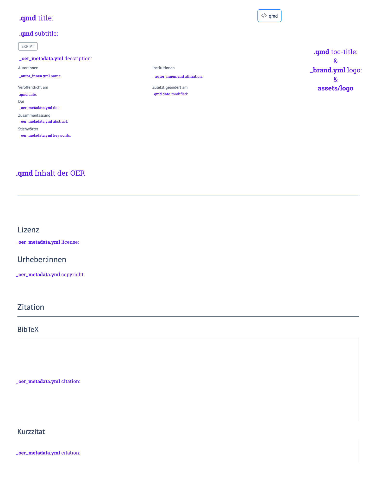

## Zielsetzung des Quick Guide

Dieser Quick Guide richtet sich an Mitglieder von NFDI4Objects, die ihre Lehrmaterialien als FAIRe Open Educational Resources (OER) mit Hilfe der Publikationsumgebung Quarto und Quarto-Templates veröffentlichen möchten. Ziel ist es, alle notwendigen Schritte kompakt auf einer Seite bereitzustellen, um die Metadaten der Lehrmaterialien minimal anzupassen, Inhalte mit den Quarto-Templates zu erstellen und diese über GitHub und GitHub Pages zu veröffentlichen. Für weitergehende Anpassungen, insbesondere im Design, sowie andere Bereitstellungsszenarien außerhalb von NFDI4Objects wird auf die ausführliche [Dokumentation der Quarto-Templates für FAIRedelte OER](https://kacebe.github.io/n4o_oer-template-dokumentation/) verwiesen.

## Voraussetzungen

Um den Workflow dieses Quick Guides umzusetzen, benötigen Sie einige grundlegende Werkzeuge. Es wird empfohlen, alle Komponenten vor Beginn einmal vollständig zu installieren. Diese werden im Folgenden kurz aufgeführt: 
**Git** – zur Versionierung der Inhalte, einen **GitHub-Account** – zur Veröffentlichung der Materialien, **Quarto** – zur Erstellung der OER als Website, **VSCodium** – als Arbeitsumgebung und die **Quarto Extension für VSCodium** – zur Unterstützung beim Schreiben und Rendern

### Git

::: panel-tabset
#### Windows

#### MacOS

#### Linux

:::

### Einrichten eines GitHub-Account

### Quarto

### VSCodium und die Quarto Extension


## Workflows

### Überblick
Für die Erstellung und Veröffentlichung der OER gibt es zwei mögliche Vorgehensweisen. Beide führen zum gleichen Ergebnis, unterscheiden sich jedoch darin, wo gearbeitet wird und wann GitHub eingebunden ist.

**Workflow 1: Lokal arbeiten**

Die Inhalte werden zunächst vollständig lokal erstellt und die Veröffentlichung erfolgt erst am Ende über GitHub.
Dieser Workflow ist geeignet für einen Einstieg ohne direkte Versionskontrolle.

**Workflow 2: Direkt in GitHub arbeiten**

Die Arbeit erfolgt direkt in einem GitHub Repositorium, sodass Änderungen kontinuierlich über Commits versioniert werden können. Dieser Workflow ist geeignet für nachvollziehbares Arbeiten von Beginn an.

<!-- Überblick der Workflows als mermaid Diagramm einbinden? -->

### Schritt für Schritt
#### Workflow 1

TODO
<!--
1. Ordner erstellen

2.  Template herunterladen

3.  Änderung ausführuen und testen

4.  Metadaten anpassen

5.  Inhalte schreiben

6.  Iteratives Überprüfen der Änderungen möglich

7.  Repository einrichten auf GitHub hochladen

8.  OER als GitHub Pages ausspielen

9.  Veröffentlichung aufrufen
-->
#### Workflow 2

TODO
<!--
1. Use template in GitHub

2.  git clone

3.  Metadaten anpassen

4.  Inhalte schreiben

5.  Iteratives Überprüfen und Pushen der Änderungen möglich

6.  OER als GitHub Pages ausspielen

7.  Veröffentlichung aufrufen
-->

## Metadaten im Template anpassen

Die wichtigsten Anpassungen im Template betreffen zunächst die Metadaten der OER wie beispielsweise Titel, Autor und Zusammenfassung. Zur Orientierung zeigt der folgende **Screenshot**, wo diese Informationen in der gerenderten OER erscheinen und an welchen Stellen im Code sie definiert werden:

{fig-alt=""}


### Anpassungen im Code

::: panel-tabset
#### `.qmd` Datei:

1.  Titel anpassen (Zeile 2)
2.  Untertitel anpassen oder Zeile löschen (Zeile 3)
3.  Datum der Veröffentlichung eintragen (Zeile 5)
4.  Logo wird unter toc-title eingebunden (Zeile 17)
5. 

``` yaml
---
title: "OER-Skript"
subtitle: "Untertitel des OER-Skripts"
lang: de
date: 1900-01-01
date-format: "DD.MM.YYYY"
date-modified: last-modified
metadata-files:
 - _layout.yml
 - _autor_innen.yml
 - _oer_metadata.yml
# Optional
bibliography: bibliographie.bib
toc: true
toc-expand: true
toc-title: |
 
toc-location: right
number-sections: true # Auf false setzen, wenn keine automatische Abschnittsnummerierung gewünscht
lightbox: true
crossref: 
 lof-title: "Liste der Abbildungen"
# Für CI-build in github
execute:
 freeze: auto
```

#### `_autor_innen.yml`

Angaben zu den Autor:innen

``` yaml
author:
  - name:
      given: Jane
      family: Doe
    orcid: 0000-0000-0000-0000
    email: jane@doe.com
    affiliation: 
      - name: Janes Institution
        city: Janes City
        url: https://jane.doe.com
    attributes:
      corresponding: true
    role: "writing – original draft"
```

#### `_oer_metadata.yml`

Platzhalter, Codeschnipsel kürzen

``` yaml
# Beschreibende Metadaten
abstract: |
  Abstract zum Skript.
abstract-title: "Zusammenfassung"
description: |
  Kurzbeschreibung der Inhalte des Skripts.
funding: |
  Optionale Angaben zur Förderung, in deren Rahmen das Skript erstellt wurde
# vgl. https://quarto.org/docs/authoring/front-matter.html#funding

# Open Graph Metadaten für HTML-Header: https://quarto.org/docs/websites/website-tools.html#open-graph
website:
  open-graph:
    locale: de_DE
    type: article

# Erschließung der Inhalte mit Quarto
# Mit categories und keywords können die Inhalte von Quarto-Dokumenten auf zwei Ebenen erschlossen werden. Übersichtsseiten mit Suchfunktion lassen sich so automatisch mit Quarto erstellen. vgl. https://quarto.org/docs/websites/website-listings.html
# Für 'categories' sollte das kontrollierte Vokabular der dini-AG "Kompetenzzentrum Interoperable Metadaten (KIM)" genutzt werden: https://skohub.io/dini-ag-kim/hcrt/heads/master/w3id.org/kim/hcrt/index.html
categories:
  - Skript
# Für die inhaltliche Erschließung keywords/Stichworte/tags sollte ein kontrolliertes Vokabular genutzt werden.
keywords:
  - Stichwort 1
  - Stichwort 2

# Technische Metadaten
site-url: &site https://nfdi4objects.github.io/oer-template-skript/
repo-url: &repo https://github.com/nfdi4objects/oer-template-skript
doi: XXXXXXX.XXXXXXX

# Vorgaben für den Appendix "Zitat"
csl: assets/csl/internet-archaeology.csl # Verweis auf CSL-Datei mit Zitierformat. Weitere CSL-Dateien im Verzeichnis assets/csl/. Fehlende CSL-Dateien können hier heruntergeladen werden: https://www.zotero.org/styles
# vgl. https://quarto.org/docs/reference/metadata/citation.html
citation:
  type: document
  container-title: "Open Educational Resource"
  publisher: Institution
  issued: 2025
  url: *site
  license: "https://creativecommons.org/licenses/by/4.0/"

# Rechtliche Metadaten
copyright: "Freitext-Angaben zu Inhaber:innen des Urheberrechts an den Inhalten (Anzupassen im Schlüssel `copyright` in der Datei `_oer_metadata.yml`)"
license: CC BY # # Optionen für Lizensierungsangaben: https://quarto.org/docs/authoring/front-matter.html#license. Wird übernommen in automatisch erstellten Appendix "Lizenz".

# Spezifische Metadaten für den Export in fachliche Metadatenschemata

# OERSI (vgl. https://oersi.gitlab.io/metadata-form/metadata-generator.html)
bildungsstufe: https://w3id.org/kim/educationalLevel/level_A
materialart: https://w3id.org/kim/hcrt/script
status: Draft  # Draft, Incomplete, Published

# Schema für eigene Key-Value-Paare mit Bindestrich: custom-key: "custom-value"
beispiel-key: beispiel-value
# Shortcuts für Verweise auf verlinkte OER-Bausteine für die Nutzung im Text. Beispiel:
# url_n4o-oer_metadaten: https://gitlab.rlp.net/n4o/oer-bausteine/n4o-oer-skript-einfuehrung-metadaten'
# Referenz  im Text: 

template-doku-url: https://nfdi4objects.github.io/oer-template-dokumentation/
```

#### `brand.yml`

Pfadangaben zur den Dateien der Logos (Z. 4-10) und Definition der Shortcodes (Z. 12-14)

``` yaml
logo:
  images:
    icon-logo:
      path: assets/logos/logo_klein.png
      alt: "Icon"
    institution-logo:
      path: assets/logos/logo.png
      alt: "Logo der Institution"
    projekt-logo:
      path: assets/logos/logo_gross.png
      alt: "Logo des Projekts"
  small: icon-logo
  medium: institution-logo
  large: projekt-logo
```

:::

## Inhalte schreiben und Codesnippets verwenden

Die Inhalte werden ausschließlich in der `.qmd`-Datei erstellt. Für eine abwechslungsreiche Gestaltung können verschiedene Elemente genutzt werden, die in den folgenden Ressourcen vorgestellt sind.

* [Design-Beispiele](https://kacebe.github.io/n4o_oer-template-dokumentation/data/quarto-designtest.html) 
* [OER-Snippets](https://kacebe.github.io/n4o_oer-template-dokumentation/data/quarto-oer-snippets.html)  
* [Markdown Basics](https://quarto.org/docs/authoring/markdown-basics.html)


TODO: Ablage von Bildern & Bibliographie

## Weiterführende Quellen und Informationen {.appendix .unnumbered}

<!-- Der Ort für weiterführende Quellen und Informationen. Wenn Sie Fußnoten oder Literaturverweise im Text eingefügt haben, werden die bibliographischen Angaben automatisch in weiteren Abschnitten generiert und in das Dokument eingefügt. -->

## Nachnutzen {.appendix .unnumbered}

Alle sind herzlich eingeladen, diesen Baustein und die zugehörige Copyleft-Lizenz zu nutzen, um ihr Wissen und Expertise in die Verbesserung und Aktualisierung einzubringen. Alle können die Inhalte erweitern oder überarbeiten, zum Beispiel um Anwendungsszenarien und Nutzungskontexte zu erweitern.

Unser Wunsch ist ein lebendiges, stetig wachsendes Dokument, das sich durch die Beiträge vieler verändert - im Einklang mit eines sich wandelnden Umfelds. Wir freuen uns im Falle einer Überarbeitung über eine kurze Notiz – das ist aber selbstverständlich keine Pflicht.

<!-- Verweise auf Website und Repository werden in _oer_metadata.yml global festgelegt. Wenn die OER nicht in einem git-Repository gehostet oder online bereitgestellt werden, können die folgenden zwei Zeilen gelöscht werden. -->

:link: [Dieser Baustein als Website]()

:link: [Quarto-Quellcode dieses Bausteins]()

------------------------------------------------------------------------

Dieses Skript nutzt das [OER-Skript-Template von NFDI4Objects](https://github.com/nfdi4objects/oer-template-skript)

## Disclaimer: Einsatz von LLM {.appendix .unnumbered}

<!-- Optionale Angaben zum Einsatz von LLM bei der Erstellung oder Überarbeitung des Skripts -->

```{=html}
<!-- An dieser Stelle werden von Quarto automatisch generierte Abschnitte angehängt:

Bibliographie:
Erstellt aus den in der qmd-Datei mit [@bibtex-Schlüssel] referenzierten Einträgen aus der Datei bibliographie.bib.
Im Text nicht referenzierte Einträge aus der bibliographie.bib werden nicht zitiert.
Der Zitierstil wird in der _oer_metadata.yml mit dem Schlüssel 'csl:' festgelegt. Im Verzeichnis /assets/csl/ sind gängige Zitierstile als csl-Datei vorhanden. Weitere sind hier zu finden: https://www.zotero.org/styles

Lizenz:
Angabe wird übernommen aus Schlüssel 'license:' in _oer_metadata.yml

Urheber:innen
Angabe wird übernommen aus der _oer_metadata.yml Schlüssel 'copyright:'

Zitiervorschläge
Mit BibTeX zitieren:
Automatisch von Quarto aus den Metadaten insb. aus dem Schlüssel 'citation:' in der _oer_metadata.yml generiertes bibtex-Zitat.

Bitte zitieren Sie diesen OER-Baustein als:
Angabe generiert aus:
  _autor_innen.yml
  Schlüssel 'title:' in der qmd-Datei
  Schlüssel 'issued' in der _oer_metadata.yml
  Schlüssel 'doi:' in der _oer_metadata.yml / Wenn keine doi gesetzt wird der Titel mit dem Wert aus 'site-url:' in _oer_metadata.yml verlinkt.
-->
```